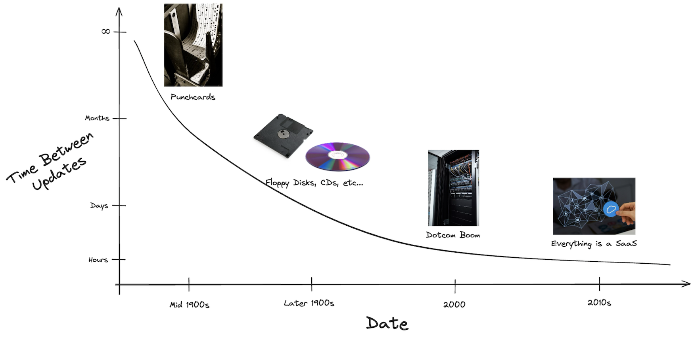
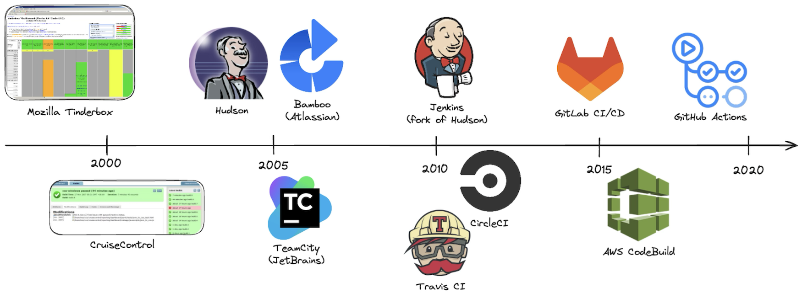

# 01. 历史与动机

> 🌐 **语言 / Language：** [English](./README.md) ｜ **简体中文**

持续集成（Continuous Integration，CI）彻底改变了我们构建、测试和交付软件的方式。得益于数十年来工具与流程上的持续创新，过去需要数周甚至数月才能完成的事情，如今几分钟就能搞定。

## 软件交付速度的历史演变

几十年来，从「写下代码」到「交付软件」之间的时间被大幅压缩：

| 时代             | 交付方式               | 交付周期        |
|-----------------|-------------------------------|------------------------|
| 🧮 1960–70 年代      | **打孔卡 / 大型机**    | 永远？😅         |
| 💾 1980–90 年代      | **软盘、光盘**          | 数月              |
| 🌐 2000 年代          | **服务器部署**         | 每天到每周      |
| ☁️ 2010 年代至今      | **CI/CD 流水线与云**     | 每天多次 |

## CI 系统发展史

| 年份 | CI 工具           | 意义 |
|------|-------------------|--------------|
| 1997 | **Tinderbox**     | Mozilla 早期的构建跟踪系统 —— 最早具备 CI 雏形的系统之一。 |
| 2001 | **CruiseControl** | 首个被广泛采用的开源 CI 服务器。 |
| 2004 | **Hudson**        | 为 Java CI 提供了友好的界面与插件支持；被广泛采用。 |
| 2006 | **TeamCity**      | JetBrains 的商业 CI 产品，与 IDE 和测试的集成非常紧密。 |
| 2007 | **Bamboo**        | Atlassian 的 CI/CD 工具，与 JIRA/Bitbucket 深度集成。 |
| 2011 | **Jenkins**       | 由社区驱动的 Hudson 分支；此后多年一直是 CI 的事实标准。 |
| 2011 | **Travis CI**     | 首个 GitHub 原生的 CI/CD 托管服务。 |
| 2011 | **CircleCI**      | 云端 CI/CD，反馈迅速，原生支持 Docker 构建。 |
| 2015 | **GitLab CI/CD**  | GitLab 内置的 CI/CD 流水线，通过 YAML 进行配置。 |
| 2016 | **AWS CodeBuild** | AWS 生态内的托管 CI。 |
| 2018 | **GitHub Actions**| GitHub 原生的自动化能力，拥有深厚的生态与社区支持。 |

