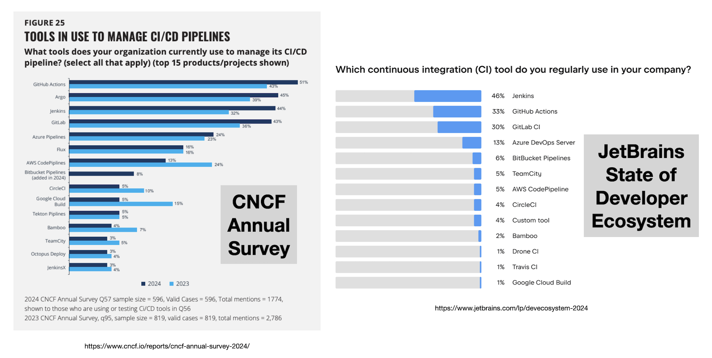

# 02. 为什么选择 GitHub Actions

> 🌐 **语言 / Language：** [English](./README.md) ｜ **简体中文**

GitHub Actions 是业界最流行的 CI 工具之一。下面把它与其他几个主流选择做个对比：

| 工具        | 优势（为什么选它？）                                                                                                                                             | 劣势（为什么不选它？）                                                                                                                |
|-------------|-------------------------------------------------------------------------------------------------------------------------------------------------------|------------------------------------------------------------------------------------------------------------------------|
| GitHub Actions | • 你的代码（很可能）已经在 GitHub 上了    • 入门门槛极低   • 庞大开放的公共 Marketplace   • 市场领先地位带来更好的工具生态（比如 [namespace.so](https://namespace.so)！） | • 如果你还没在用 GitHub   • 流水线复用的原语能力相对薄弱   • 调试体验痛苦   • 分析与可观测性有限 |
| GitLab CI   | • 你的代码（可能）已经在 GitLab 上了   • 入门门槛极低（如果你用 GitLab）   • 与 GitLab 其他功能深度集成   • GitLab 的「Auto DevOps」 | • 如果你还没在用 GitLab   • 公共 Marketplace 较小（总计不到 500 个）                                       |
| CircleCI    | • 你的代码既不在 GitHub 也不在 GitLab（CircleCI 与版本控制系统无关）   • 内置的「retry with SSH」功能非常给力 🔥                                            | • 需要额外的初始配置（相比 GHA + GitLab）   • 公共 orbs Marketplace 较小（总计 3653 个）                           |
| Jenkins     | • 你（可能）已经在用它了   • 插件生态极其庞大                                                                                      | • 维护成本很高（安全补丁与插件依赖）   • Groovy 流水线 DSL 显得过时    |
