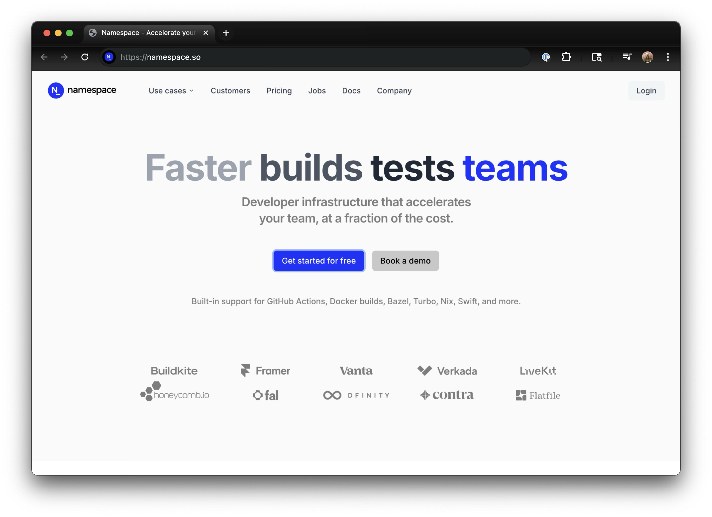

# DevOps Directive GitHub Actions 课程

> 🌐 **语言 / Language：** [English](./README.md) ｜ **简体中文**

这是配套仓库，对应课程：[GitHub Actions: Beginner to Pro](https://courses.devopsdirective.com/github-actions-beginner-to-pro)

[](https://youtu.be/Xwpi0ITkL3U)

## 🙌 由 Namespace Labs 赞助

本课程得以推出，要感谢 [namespace.so](https://namespace.so/?utm_source=devopsdirective) —— 它是提升软件构建与开发者工作流的绝佳方式！


[](https://namespace.so/?utm_source=devopsdirective)

- **更快的 GitHub Actions：** 托管式 GHA 运行器，以极低的成本换来更快的运行速度！
- **更快的 Docker 构建：** 远程 Docker 构建器，让容器构建速度大幅提升！
- **持续集成可观测性：** 清晰的指标与分析，帮助你进一步优化 CI！

## 📚 课程大纲
- **历史与动机（History & Motivation）：** 为什么流水线自动化很重要，以及它影响了哪些部署指标。
- **为什么选择 GitHub Actions？（Why GitHub Actions?）：** 托管运行器、Marketplace，以及与其他 CI/CD 工具的对比。
- **核心功能（Core Features）：** workflow、job、step、事件、表达式与密钥。
- **高级功能（Advanced Features）：** 权限、第三方认证、缓存、制品与运行器选项。
- **Marketplace Actions：** 发现并安全地使用社区 action。
- **编写 Action（Authoring Actions）：** 复合 action、可复用工作流、JavaScript action 与容器 action。
- **常见工作流（Common Workflows）：** 校验、构建、部署并自动化你的仓库。
- **开发者体验（Developer Experience）：** 用 act 在本地运行、调试运行过程、收集洞察。
- **最佳实践（Best Practices）：** 性能调优、可维护性与安全。
- **结课项目（Capstone Project）：** 在动手实战中综合运用所学的一切。

## 📖 中文文档索引

本文档是英文原版的中文翻译。英文原文保持原样未作改动，可随时对照阅读。

| 章节 | 中文文档 | 英文原文 |
| --- | --- | --- |
| 课程总览 | [README.zh-CN.md](./README.zh-CN.md) | [README.md](./README.md) |
| 01 历史与动机 | [01-history-and-motivation/README.zh-CN.md](./01-history-and-motivation/README.zh-CN.md) | [README.md](./01-history-and-motivation/README.md) |
| 02 为什么选择 GitHub Actions | [02-why-github-actions/README.zh-CN.md](./02-why-github-actions/README.zh-CN.md) | [README.md](./02-why-github-actions/README.md) |
| 03 核心功能 | [03-core-features/README.zh-CN.md](./03-core-features/README.zh-CN.md) | [README.md](./03-core-features/README.md) |
| 04 高级功能 | [04-advanced-features/README.zh-CN.md](./04-advanced-features/README.zh-CN.md) | [README.md](./04-advanced-features/README.md) |
| 05 Marketplace Actions | [05-marketplace-actions/README.zh-CN.md](./05-marketplace-actions/README.zh-CN.md) | [README.md](./05-marketplace-actions/README.md) |
| 06 编写 Action | [06-authoring-actions/README.zh-CN.md](./06-authoring-actions/README.zh-CN.md) | [README.md](./06-authoring-actions/README.md) |
| 07 常见工作流 | [07-common-workflows/README.zh-CN.md](./07-common-workflows/README.zh-CN.md) | [README.md](./07-common-workflows/README.md) |
| 08 开发者体验 | [08-developer-experience/README.zh-CN.md](./08-developer-experience/README.zh-CN.md) | [README.md](./08-developer-experience/README.md) |
| 09 最佳实践 | [09-best-practices/README.zh-CN.md](./09-best-practices/README.zh-CN.md) | [README.md](./09-best-practices/README.md) |

👉 另外推荐先读一遍 **[中英术语对照表](./GLOSSARY.zh-CN.md)**，其中整理了本课程高频词汇的推荐译法，避免阅读时产生歧义。

> [!NOTE]
> `.github/workflows/` 下所有 workflow 文件的英文注释也已翻译为中文；YAML 的键名（key）、`name:` 值、`run:` 中的命令与脚本逻辑均保持原样未改动，因此这些文件的行为与上游仓库完全一致。
> 05 模块的子目录 `06-authoring-actions/*/action.yaml` 中的注释同样已翻译，但 `description:` 字段保持英文（它会直接显示在 GitHub 界面上）。

## 开发环境搭建

1. **克隆本仓库（包括子模块）**
```bash
git clone --recurse-submodules git@github.com:sidpalas/devops-directive-github-actions-course.git
```

2. **安装 DevBox** —— DevBox 会引导安装所需的全部 CLI 工具（Go、Node.js、Python、`act`、`task`、`npc`、`civo`、`gh`、`jq`、`yq`、`kubectl`、`kluctl` 等等）。
   请按照官方安装指南操作：<https://www.jetify.com/docs/devbox/installing-devbox/index#>

   安装 devbox 之后，运行 `devbox shell` 启动一个已经装好/配置好这些工具的 shell 会话。

3. **安装 Docker Desktop**
   前往以下地址下载并安装：<https://docs.docker.com/get-started/introduction/get-docker-desktop/>

4. **配置 VS Code**

      a. **YAML** —— YAML 语法高亮与检查（lint）

      b. **GitHub Actions**（可选）：workflow 文件语法高亮与代码片段

> [!WARNING]
> GitHub Actions 扩展会修改 `/.github/workflows/` 下文件的「文件类型」，导致 YAML 扩展无法识别这些文件。
> 要解决这个问题，可以在设置中显式添加 `files.associations` 配置项：
>
> ```json
> {
>   "files.associations": {
>     "**/.github/workflows/*.{yml,yaml}": "yaml",
>     "**/Taskfile.{yml,yaml}": "yaml"
>   }
> }
> ```
